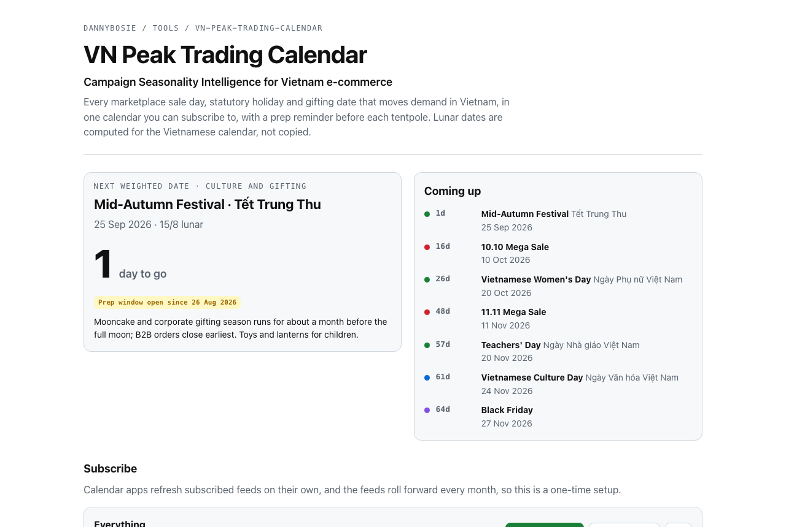

# VN Peak Trading Calendar

**Campaign Seasonality Intelligence for Vietnam e-commerce.** Every marketplace sale day, statutory holiday and gifting date that moves demand in Vietnam, as calendar feeds you subscribe to once, with a prep reminder before each tentpole.

**[Open the calendar](https://dannybosie.github.io/vn-peak-trading-calendar/)** to see what is coming up, plan a year, or subscribe in Google Calendar, Apple Calendar or Outlook.

[](https://dannybosie.github.io/vn-peak-trading-calendar/)

## Why

A Vietnam campaign plan has three calendars in it: the marketplace one (double days, mid-month, payday), the statutory one (Tết and the long weekends, when couriers slow down), and the lunar one (Mid-Autumn, Vu Lan, Vía Thần Tài), whose dates move every year. Most teams keep them in a spreadsheet someone updates in January, and the lunar dates get copied from whichever website comes up first.

This repository keeps all three in code, computes the lunar dates, and publishes them as feeds that update themselves.

## Subscribe

| Feed | What is in it | Subscribe |
|---|---|---|
| Everything | All of the below | [`all.ics`](https://dannybosie.github.io/vn-peak-trading-calendar/feeds/all.ics) |
| Sales | 1.1 to 12.12, mid-month (15th) and payday (25th) windows, Black Friday, Cyber Monday | [`sales.ics`](https://dannybosie.github.io/vn-peak-trading-calendar/feeds/sales.ics) |
| Holidays | Statutory paid days off, with official schedules where announced | [`holidays.ics`](https://dannybosie.github.io/vn-peak-trading-calendar/feeds/holidays.ics) |
| Culture and gifting | Ông Công Ông Táo, Vía Thần Tài, 8/3, 1/6, Vu Lan, Mid-Autumn, 20/10, 20/11, Christmas | [`culture.ics`](https://dannybosie.github.io/vn-peak-trading-calendar/feeds/culture.ics) |
| Prep reminders | One event on the day campaign prep should start for each weighted date | [`prep.ics`](https://dannybosie.github.io/vn-peak-trading-calendar/feeds/prep.ics) |

In Google Calendar: **Other calendars**, then **From URL**, and paste the feed link. In Apple Calendar: **File**, then **New Calendar Subscription**. The one-click buttons are on the [calendar page](https://dannybosie.github.io/vn-peak-trading-calendar/).

The feeds cover last year to two years ahead and are rebuilt on the first of every month, so they roll forward on their own. Events carry bilingual titles (`Mid-Autumn Festival · Tết Trung Thu`), a note on what the date means commercially, and the lunar date where there is one.

## What is in it

| Type | Dates | Weight |
|---|---|---|
| Mega sale | 1.1 to 12.12 | 11.11 and 12.12 are tentpoles; 6.6, 7.7, 9.9 and 10.10 are majors |
| Mid-month and payday | Around the 15th; the 25th to month end | Monthly |
| Global sale | Black Friday (day after the 4th Thursday of November), Cyber Monday | Major, minor |
| Holiday | 1/1, Tết, Giỗ Tổ (10/3 lunar), 30/4, 1/5, 2/9, and 24/11 from 2026 | Tết is a tentpole |
| Culture and gifting | Ông Công Ông Táo, Valentine's Day, Vía Thần Tài, Rằm tháng Giêng, 8/3, 1/6, Đoan Ngọ, Vu Lan, Mid-Autumn, 20/10, 20/11, Christmas | Mid-Autumn is a tentpole |

Prep reminders sit 60 days before Tết, 30 before Mid-Autumn, 21 before 11.11 and 12.12, and 7 to 14 days before the other weighted dates. All of it lives in [`src/core/events.ts`](src/core/events.ts), one entry per date, each with a note on what it means for demand.

## The lunar dates are computed, and tested

Tết, Vía Thần Tài, Giỗ Tổ, Đoan Ngọ, Vu Lan, Mid-Autumn and Ông Công Ông Táo move every year. They are computed for the Vietnamese calendar (UTC+7), which is not the Chinese one: Tết 2007 was 17 February in Vietnam and 18 February in China, and Tết 1985 was a whole month apart. Both cases are in the tests.

The calendar rules follow Hồ Ngọc Đức's widely used formulation. The astronomy does not use the usual shortcut. The common truncated new-moon series puts the new moon of 12 August 2026 before midnight, and so puts Vu Lan 2026 on 26 August. The full series from Meeus's *Astronomical Algorithms* puts it at 00:37 on 13 August, and Vu Lan on 27 August, which is what the published calendars say.

Every lunar festival from 2025 to 2028 is checked against published Vietnamese calendars in [`test/lunar.test.ts`](test/lunar.test.ts), along with the leap months (6th month of 2025, 5th month of 2028).

## Command line

```sh
npx github:dannybosie/vn-peak-trading-calendar next --type mega-sale,cultural,holiday,global-sale
```

```text
2026-09-25             in 1d    Culture and gifting  Mid-Autumn Festival · Tết Trung Thu  [prep window open]
2026-10-10             in 16d   Mega sale            10.10 Mega Sale
2026-10-20             in 26d   Culture and gifting  Vietnamese Women's Day · Ngày Phụ nữ Việt Nam
2026-11-11             in 48d   Mega sale            11.11 Mega Sale
2026-11-20             in 57d   Culture and gifting  Teachers' Day · Ngày Nhà giáo Việt Nam
2026-11-24             in 61d   Holiday              Day off: Vietnamese Culture Day · Ngày Văn hóa Việt Nam
```

```sh
vn-peak list --year 2027 --type holiday,cultural   # a whole year
vn-peak ics --from 2026 --to 2028 --feed sales      # write your own feed
vn-peak lunar 2026-08-27                            # 15/7, lunar year 2026
vn-peak solar 15/8/2027                             # 2027-09-15
```

The same data as JSON: [`feeds/events.json`](https://dannybosie.github.io/vn-peak-trading-calendar/feeds/events.json).

## Limits

- Marketplace windows vary by platform and by year. The feed marks the anchor day (the 15th, the 25th, the double day); check each platform's seller center for exact campaign windows and registration deadlines.
- Statutory holidays are placed on their legal dates. The actual days off, and the swaps that make long weekends, are decided each year; announced schedules are added to the event notes as they come out.
- Tentpole weights and prep windows are a planning default from practice, not a law of nature. Change them in `src/core/events.ts`.

## Development

```sh
npm install
npm test          # node:test: lunar fixtures, event rules, ICS format
npm run build     # CLI, web page and all feeds into site/feeds/
```

## License

MIT. Built by [Thinh Nguyen (Danny)](https://github.com/dannybosie).
